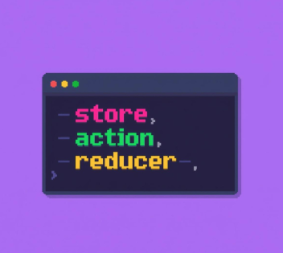
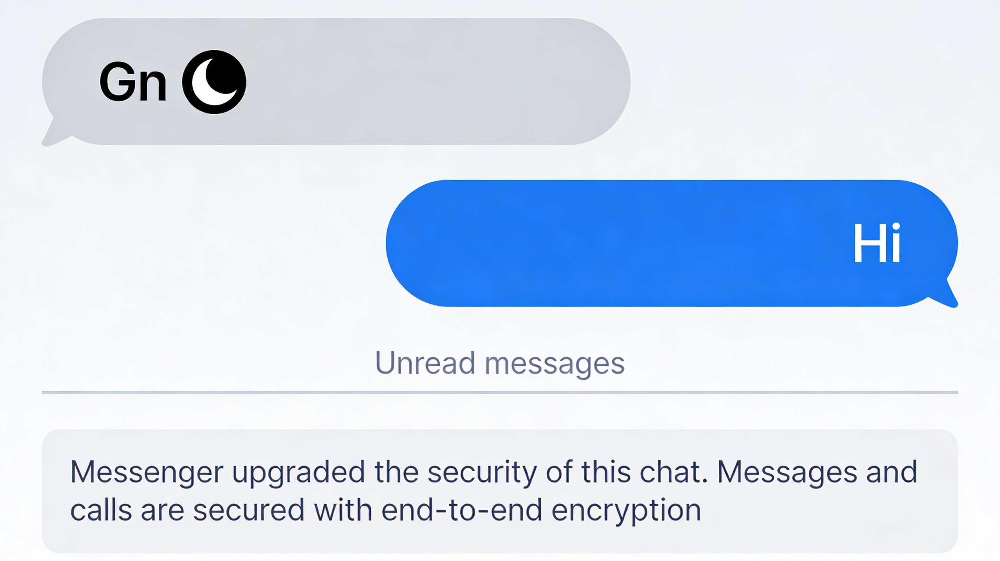
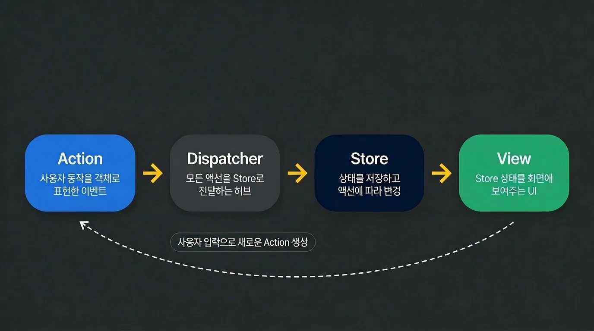

import CodeWithLineNotes from '../../../components/CodeWithLineNotes.astro';



이전글에서 React가 "복잡한 UI를 효율적으로 그리는 문제"를 해결하기 위해 탄생한 과정을 살펴보았습니다. 
그렇다면 React가 UI 렌더링을 해결하는 동안, "상태를 어디에 두고, 누가 바꾸고, 어떻게 추적할지" 고민은 없었을까요?

이번 글에서는 

•&nbsp; 상태관리의 문제가 무엇이었는지,  
•&nbsp; 그 문제를 해결하기 위해 Flux 패턴이 어떻게 등장했는지,  
•&nbsp; 그리고 Flux에서 Redux로 어떻게 발전했는지를 알아 보도록 하겠습니다.  

#### 1. MVC의 양방향 패턴의 한계

React가 등장하기 이전부터, Facebook은 MVC 스타일 구조와 데이터 흐름 패턴을 많이 사용하고 있었습니다.  
이 방식은 초기에 잘 동작했습니다.

```jsx
① View -> ② Controller -> ③ Model -> ④ View
                            
① 사용자가 화면에서 입력
② Controller가 입력을 받아 처리
③ Model의 데이터를 갱신
④ 갱신된 데이터로 View를 다시 출력
```

그러나 기능이 많아질수록 점점 한계를 드러내기 시작했습니다.  
그 한계는 기능간의 영향을 주고 받는 <u style="color: red; font-weight: bold;">연쇄적인 업데이트(Cascading Updates)</u> 많아진 점 이였습니다.

```html
기능1 : ① View -> ② Controller -> ③ Model -> ④View -> Controller...
                                                ↓  ⑤ (기능②의 Controller에도 영향)
기능2 :                                   ⑥ Controller -> ⑦ Model -> ⑧ View -> Controller...
                                                                         ↓ (기능③의 Controller에도 영향)
기능3 :                                                                  ...

① 기능1의 View에서 사용자가 입력
② 기능1의 Controller가 입력을 받아 처리
③ 기능1의 Model 데이터가 갱신됨
④ 갱신된 데이터로 기능1의 View가 업데이트됨

⑤ 기능1의 View 변경이 기능2의 Controller에도 영향을 줌 [Cascading Updates]
⑥ 기능2의 Controller가 의도하지 않은 갱신을 받아 처리함
⑦ 기능2의 Model 데이터가 갱신됨
⑧ 기능2의 View가 잘못된 상태로 출력됨

⑨ 기능2의 View 변경이 기능3의 Controller에도 영향을 줌 [Cascading Updates]

...

```

핵심은 이런 <u style="color: red; font-weight: bold;">연쇄적인 업데이트(Cascading Updates)</u>가 여러곳에서 동시에 일어난다는 점입니다.

물론, 기능이 적은 상태에서는 많은 데이터를 관리하지 않기 때문에 추적이 가능했을 것입니다.  
하지만 이러한 영향이 많아지게 되자, <u style="color: red; font-weight: bold;">개발 및 유지보수에서 심각한 문제</u>로 떠오르기 시작했습니다.

#### 2. '안 읽은 메시지 버그' — 상태 관리 실패의 대표 사례

이러한 문제가 실제로 터진 대표적인 사례가 있었습니다. 페이스북에서는 "실제로 새 메시지가 없는데도, 새 메시지가 있다고 사용자에게 알리는 채팅 버그"가 있었습니다.  

이는 앞서 말한 "연쇄적인 업데이트 내용"이 영향을 주면서, 서로의 '컨트롤러'와 '모델'에 값이 갱신되고, 어느 부분에서 값이 바뀌었는지 알 수 없는 문제였습니다.



메시지를 담당하는 모델은 읽었다고 해도, 영향을 주는 다른 모델'들'은 아직 안 읽었다고 하는 상황이죠.  
즉 타 모델들에 의해 갱신되는 메시지 모델은 읽지 않았다고 말하는 것입니다.

이렇듯 문제의 원인은 코드의 특정 위치가 아니라 <u style="color: red; font-weight: bold;">"모델들이 다른기능의 모델에 영향을 주는 구조"</u> 였습니다.   
이 문제를 계기로 Facebook은 "이렇게 구조를 가져서는 안되겠다"고 판단하게 됩니다.

#### 3. Flux 패턴 — "예측 가능한 단방향으로 만들자"

그리고 이를 해결하고자 등장한 패턴이 Flux 패턴입니다.
 

 
정리하자면 아래와 같습니다.

[1] 기존 MVC에서는 연쇄적인 업데이트가 동시에 일어나, 어느 Model에서 값이 변경되었는지 알 수 없었습니다.  
[2] Flux는 이를 Dispatcher와 Store로 해결합니다.  
[3] Dispatcher는 액션을 Store에 전달하는 단일통로이며, <u>한 번에 하나의 Action</u>만 처리하도록 강제합니다.  
[4] 이전 Action이 완전히 끝나야 다음 Action이 처리됩니다.  
[5] Store는 상태를 한 곳에서 관리하여, "안 읽은 메시지", "채팅 목록" 등의 같은 기능들이 Store에서 값을 읽게 됩니다.

결론적으로는  

[1] Dispatcher가 처리 순서를 지정 -> (동시에 영향을 주던 문제 해결)  
[2] Store가 상태를 한 곳에서 관리 -> (어디서 바뀌었는지 모르는 문제 해결)

이렇게 제어가 안되던 부분을 flux 패턴으로 개선하게 된 것입니다.