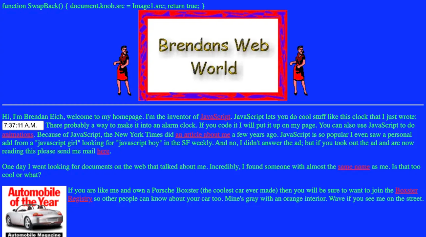

import CodeWithLineNotes from '../../../components/CodeWithLineNotes.astro';


> [공식문서](https://developer.mozilla.org/ko/docs/Web/JavaScript/Reference/Statements/var)를 보고 느낀 의문점에 대해 서술한 글입니다. | 2026-02-20 기준

저의 경우에는 JS를 처음 배울때 var,let,const 중 무엇을 써야할지 많이 헷갈렸습니다. 이를 알기위해 공식문서를 봤었지만, 오히려 의문점만 더 커졌던 경험이 있습니다. 

더불어 "var 쓰지마세요."라는 말도 가끔 들었었는데요, 그렇다면 var는 쓰지않는데 왜 존재하는 것일까요?  
이번 글에서는 그 의문점을 해결하고자 'var의 작동원리와 탄생배경' 그리고 'let, const가 어떻게 생겨났는지' 작성해 보고자 합니다.  

#### 1. "공식문서의 var설명"
그렇다면 var를 배우면서 의문점이 커졌던 점은 무엇이였을까요? 바로 <u style="color: red; font-weight: bold;">var의 호이스팅</u>이였습니다.   
왜냐하면, 기존에 알고있던 블록, 스코프 개념에 혼동을 주었기 때문입니다.

<CodeWithLineNotes
  code={
  `
  // 공식문서의 var설명

  var x = 1;
  if (x === 1) {
    var x = 2;
    console.log(x); // Expected output: 2
  }

  console.log(x);   // Expected output: 2
  `
  }

  notes={{
    4: "1. 전역변수 값이 1인 상태",
    6: "2. 함수 블록 안에서 var x=2로 재선언",
    10: "3. 전역변수 값이 2인 상태(??)"
  }}

/>

보틍은 함수값은 지역변수로서 전역변수에 영향을 주지 않는다고 알고 있습니다.  
그러나 2번의 재선언의 경우는 함수스코프를 벗어나서 전역변수에 영향을 주고 있는 것으로 보입니다.

또한 공식문서에서 '변수를 선언, 선택적으로 초기화 할 수 있습니다.' 라고 설명하고 있습니다.  
"변수를 선언한다."까지는 이해가 된다해도... "선택적으로 초기화 할 수 있다?"

일단은 코드와 공식문서 설명이 매칭이 되지 않는것 같아서, 관련 문헌들을 검색해 보았습니다.  
그리고 이에 관한 저만의 결론은 아래와 같았습니다.

•&nbsp; var 문은 변수를 선언하고, <u style="color: red; font-weight: bold;">선택적으로 초기화할 수 있다</u>의 예시코드가 잘못 되었다.    
•&nbsp; var는 블록안에서의 <u style="color: red; font-weight: bold;">재선언 값이 전역값에 영향을 준다.</u>

그럼 하나씩 살펴보겠습니다.

#### 2. "var 문은 변수를 선언하고, 선택적으로 초기화할 수 있다"의 예시코드가 잘못 되었다.

앞서 살펴봤듯, var문이 선택적으로 초기화 한다는 것은, 변수선언시 '초기값을 넣을지 말지를 자유롭게 지정할 수 있다는 뜻'이였습니다.
아래 var,let,const의 예시코드를 살펴봅시다.
```jsx
// var 선택적 초기화 가능
var x; // (선언 + 초기화 안함) -> undefined
var y =10; // (선언 + 초기화 함) -> 10

// let 선택적 초기화 가능
let a; //가능

// const 선택적 초기화 불가
const b; // 에러! const는 반드시 초기화해야 함.
```

어떠신지요? 

각 선언문별로 <u style="color: red; font-weight: bold;">초기화 가능여부</u>를 확인할 수 있었습니다. 그렇다면 공식문서의 예시를 다시 살펴보겠습니다.

<CodeWithLineNotes
  code={
  `
  // 공식문서의 var설명

  var x = 1;
  if (x === 1) {
    var x = 2;
    console.log(x); // Expected output: 2
  }

  console.log(x);   // Expected output: 2
  `
  }

  notes={{
    4: "1. 전역변수 값이 1인 상태",
    6: "2. 함수 블록 안에서 var x=2로 재선언",
    10: "3. 전역변수 값이 2인 상태(??)"
  }}

/>

차이가 보이시는지요?  

공식문서의 예시를 보면, var문이 <u style="color: red; font-weight: bold;">초기화 선언이 선택적으로 가능한지, 아닌지를 알 수 없습니다.</u>  
오히려 함수 블록에서 선언한 값이 전역변수에 영향을 미친다는 것만 확인이 가능했습니다.  

개인적인 의견으로는 var의 특성 전반을 보여주려다가 생긴 문제라고 생각합니다.

#### 3. var는 블록안에서의 재선언 값이 전역값에 영향을 준다.

그렇다면 공식문서의 예시는 어떻게 봐야 할까요? 

보시기전에 호이스팅의 개념을 간략히 설명하자면..  
<u style="color: red; font-weight: bold;">스코프 안에 있는 선언들을 모두 스코프의 최상위로 끌어올리는 것</u> 입니다.

그럼 var의 지역변수가 글로벌변수로 어떻게 영향을 주는지, JS엔진 관점에서 살펴보겠습니다. (호이스팅 적용)

```jsx
// 원본 내용을 JS엔진의 관점에서 호이스팅 후 코드 해석
function example() {
  var x = undefined // 호이스팅된 변수 x
  x = 1; // x는 1로 재할당

  if (x === 1) {
    x = 2; // 호이스팅 된 전역 변수(??) x는 2로 재할당

    console.log(x);
    // Expected output: 2 // 그래서 x는 최종적으로 2를 출력
  }

  console.log(x);
  // Expected output: 2 // 이미 호이스팅 된 전역변수 x는 2이기에 2를 출력
}
```

"호이스팅 된 전역 변수(??) x는 2로 재할당" 부분에서 이상함을 느끼시지 않으셨는지요? 사실은 지역변수일텐데요?  
이는 조건문 안에서 var를 선언할 경우 발생하는 호이스팅의 대표적인 문제점 중 하나입니다.

정확히 말하자면, 문제라기 보다는 var의 설계자체가 블록스코프가 아닌, 함수스코프로 지정되었기 때문입니다.

공식문서 예시의 <u style="color: #1D9BF0; font-weight: bold;">전역변수(외부) x=1</u> & <u style="color: #1D9BF0; font-weight: bold;">지역변수(조건문 내부) x=2</u> 는 JS엔진의 관점에서는 같은 스코프 x 였고,   
따라서 <u style="color: red; font-weight: bold;">지역변수 초기화 -> 전역변수 재할당</u>이 되어, 영향을 미쳤다는 것입니다.     

#### 4. var는 왜 이렇게 설계되었을까?

그렇다면 var는 왜 이렇게 설계되었을까요? 이는 JS가 태어난 배경을 먼저 알아야 합니다. 1995년, Netscape라는 웹 브라우저가 존재했으며, Brendan Eich라는 개발자는 Netscape의 요청에 의해 Web에 인터랙티브한 기능을 넣고자 언어를 제작하게 됩니다. 

이것이 JS의 시작이였습니다. 그리고 이때 탄생한 var의 배경이 당시 인터랙션(상호작용)에 대한 인식과 연관되어 있다는 점입니다.
당시의 인식이 어느정도였냐면... "전화번호나 우편번호가 제대로 입력됐는지 확인하는 기능, 오디오를 재생하는 기능" 정도의 간단한 내용이였습니다.


[Brendan Eich의 개인 홈페이지](https://web.archive.org/web/19981207072942/people.netscape.com/brendan/)

JS의 개발자의 홈페이지를 보더라도 복잡한 기능을 고려하지 않았다는 것을 알 수 있습니다. 이는 무엇을 뜻하는 것일까요? 그렇습니다. 애시당초 복잡한 웹 어플리케이션을 만들 목적으로 JS를 만들지 않았던 것입니다. 

간단한 웹 인터랙션용 스크립트 언어에 블록 스코프까지 설계할 이유가 존재하지 않았기에, 함수 단위로 변수를 관리해도 충분했습니다. 또한 Netscape에서는 10일이라는 개발기간을 주었기에 이 정도가 한계였을 것입니다.

이것이 var가 함수 스코프로 설계된 배경입니다. 잘못 만든 것이 아니라, 당시 상황에서는 합리적인 선택이였던 것이죠.   
문제는 JS가 예상과 달리 웹의 핵심 언어로 성장하면서, 이 단순한 설계가 한계를 드러내기 시작한 것 입니다.

#### 5. var의 한계를 우회하기 위한 사용법

이때 당시 var의 함수 스코프 문제를 개발자들이 몰랐던 것은 아닙니다. 웹이 점점 복잡해지면서 변수 충돌 문제가 실제로 발생하기 시작했고, 이를 해결하기 위한 패턴이 등장하였습니다. 

바로 IIFE(즉시 실행 함수 표현식)입니다.

```jsx
// IIFE 표현식 : (function() { ... })()
// 표현식 형태를 기억하면서, 코드를 읽어볼까요?

var count = 0;

(function() {
    if (true){
        var count = 10; // var는 함수스코프 이므로 갇힘
    }
})();

console.log(count); // count는 전역의 var를 출력. 따라서 0을 출력!
```

어떤가요? var를 함수스코프에 가두면서 전역변수에 영향을 안 주게 됩니다.  
다만 가독성이 떨어지지 않으신지요?

만약, 블록 스코프가 존재했다면 어땠을까요?

```jsx
let count = 0;

// 블록스코가 존재한다고 가정!
if (true){
    let count = 10; // var는 블록스코프가 존재, 전역변수에 영향을 주지 않음!
}

console.log(count); // count는 전역의 let을 출력. 따라서 0을 출력!
```

이 처럼 var의 한계를 우회하기 위한 패턴이 존재했지만, 근본적인 해결책은 아니었습니다.

#### 6. let과 const의 등장 - ES6

이후 2015년, ECMAScript6(ES6)가 발표되면서 드디어 let과 const가 등장하게 됩니다.  
var만으로 20년을 버텨온 JS에 드디어 블록 스코프 개념이 들어간 선언방식이 새로 등장한 것 입니다.

그럼 새로 도입된 let과 const의 특징을 살펴 볼까요?

> let, const - 블록 스코프 도입

```jsx
if (true){
    let a = 10; // let 또는 const는 블록 스코프이다. 따라서 if블록 안에서 생명주기를 다함
}
console.log(a) // 참조 에러!!
```

> TDZ - 임시 사각지대 도입

```jsx
// (1) 개발자 관점
console.log(x); // undefined — 에러 없이 조용히 넘어감
var x = 10;

console.log(y); // ReferenceError — 선언 전 접근 불가
let y = 10;
```

```jsx
// (2) JS엔진 관점
var x = undefined; // 호이스팅: 선언 + undefined로 초기화
console.log(x) // undefined — 에러 없이 조용히 넘어감
x = 10;

let y; // 호이스팅 : 선언 + 초기화 유보 (TDZ 구간으로 빠짐)
console.log(y) // ReferenceError: y가 초기화 되기전에는 값에 접근할 수 없습니다.
y = 10; 
```

> const - 재할당 방지
```jsx
// 변하지 말아야 할 값을 const선언을 통해 값의 변화를 막아준다.
const API_URL = "https://first_api.com"
API_URL = "https://second_api.com" // TypeError — const는 재할당 불가, let은 가능
```

#### 7. 결론

"var, let, const는 왜 생겨났을까?"  

이 질문에 대한 답은 결국에 JS의 변천사 그 자체였습니다. 간단한 인터랙션 기능을 구현할 때, JS는 쓰기 편한 언어였을 것입니다. 그러나 var의 함수 스코프가 한계를 드러냈고, 개발자들은 IIFE라는 우회 패턴으로 버텨야 했습니다. 

그리고 2015년, ES6의 let, const의 등장으로 블록 스코프, TDZ, 재할당 방지라는 근본적인 해결책이 마련되었습니다.

결국 이 3가지 선언방식의 탄생이유는 <u style="color: red; font-weight: bold;">"시대의 니즈에 맞게 변화해야 했기 때문"</u>이였습니다.  
그럼 다음 글에서는 웹 UI 라이브러리를 대표하는 React에 대해 알아보겠습니다.