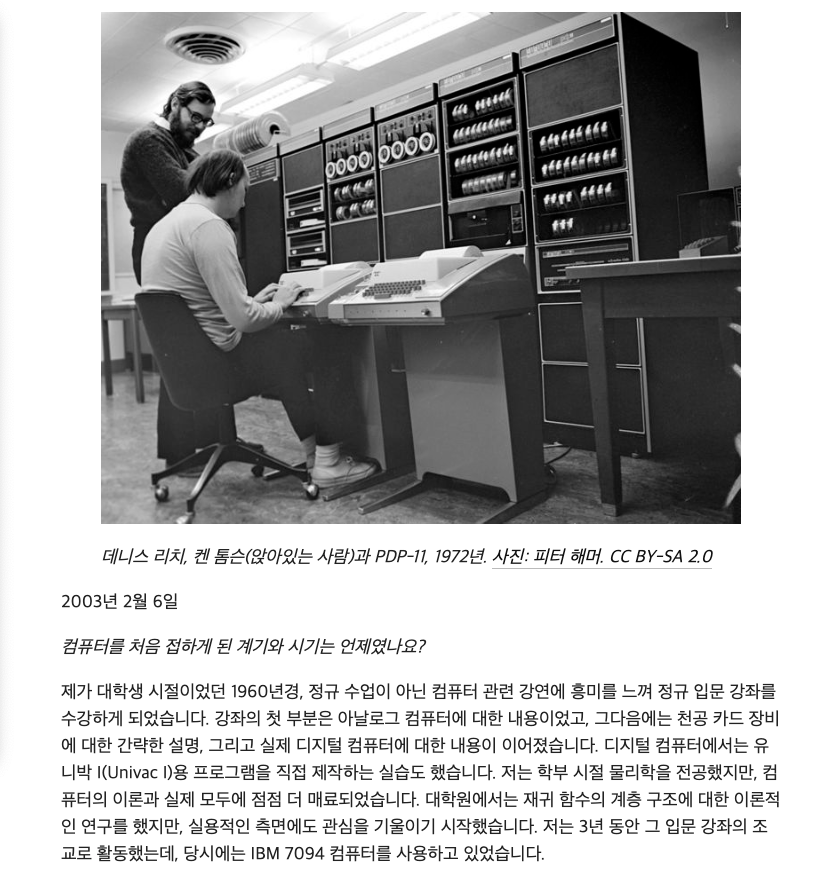

![[Reflection] 프로그래밍 학습에 왜(Why)를 묻기 시작하면서 달라진 것들](../../../assets/20260219/Thumnail.png)

이전에 x.com의 클론코딩 수업을 수강하던 중, 문득 의문이 든 점이 있었습니다.
과연 프로그래밍 공부라는 것이 다른 사람이 제시한 커리큘럼대로 공부하는 것이 맞는지에 대한 의문이였습니다.

물론 '기초적인 추상성 확보'와 '기본기 습득' 측면에서는 커리큘럼이 효율적입니다. "아, 저 기술은 저렇게 응용될 수 있구나"라는 인사이트도 있고, "오늘은 커리큘럼에서 이 정도 공부했구나"라는 안도감도 있습니다.

그러나 커리큘럼 공부가 반복되면서 점점 다른 생각이 들기 시작했습니다.  
"이것이 내가 의무감에 의해서 듣고 있는 건 아닌가?"  
"따라쳐서 작동하고 원리도 나름 이해했는데... 적합한 스킬이 맞나?"

#### 능동적 학습과 아키텍처링 사고

> 이러한 의문이 앞선 가운데, 멘토와의 대화를 통해 이를 다시 한번 생각해보게 됩니다.

나 : "이번주는 x.com의 클론코딩 수업을 통해 Next.js의 패러렐 라우팅 & 인터셉터 라우팅의 개념을 배웠습니다."  
맨토 : "좋습니다. 근데 x.com에서 저 기능은 왜 썼을까요?"  
나 : "아 그게.. x.com에서는 SPA(Sigle Page Application)원칙을 고수하다보니깐 그런거 아닐까요?"  
나 : "특히나 SNS처럼 많은 내용을 담고 있는 웹 어플리케이션은 UX(사용자 경험)관점에서 SPA가 적합하다고 생각되기에...?"  
나 : "로그인 페이지에서도 SPA원칙을 지키기 위해 패러렐 라우팅 & 인터셉터 라우팅을 썼다고 생각합니다만.."  
멘토 : "그래요? 근데 로그인은 굳이 한페이지 안에서 패러렐 라우팅 & 인터셉터 라우팅을 사용하여, 모달팝업을 띄울 필요가 있을까요?"  
나 : "??"  
멘토 : "물론 그 페이지에서 보안정보를 담고 있거나 처리하는 부분이 많다면 모달팝업을 띄워서 로그인 처리하면 된다고 생각합니다만, 이건 추측이구요."  
멘토 : "중요한 것은 학습강의에서 그 부분에 대한 언급이나 설명이 있었는지 궁금하다는 것이죠."

여기서 핵심은 무엇일까요?

개인적인 견해로는, 무엇이 답이라기 보다는 "해당 웹 어플리케이션에서 이 아키텍처가 적합한지?", "그리고 이 기술을 사용한 이유가 명확한지?"에 대한 의문 자체가 핵심이라고 생각합니다.

앞서 언급한 클론코딩의 장점으로 '추상성 확보', '기본기 습득', '인사이트', '안도감'을 언급했습니다. 이것들은 분명히 가치가 있습니다. 그러나 이를 응용하는 단계에 들어가면 이야기가 달라집니다.

"다른 사람이 제시하는 커리큘럼이, 본인이 개발하는 프로그램에서의 딱 맞는 근거가 될 수 있을까요?"

저는 이 부분이 핵심이라고 생각합니다. 개발 환경과 조건, 그리고 상황이라는 변수가 프로젝트마다 다르기 때문입니다. 기본적인 가이드라인은 배울 수 있습니다. 다만 그것을 어디에 어떻게 적용할지, 그 선택의 책임과 고민은 오롯이 본인 몫입니다.

즉, '맞다/틀렸다'라는 이분법적 사고보다는, '이것이 적합한가?', '더 나은 방식과 그 이유가 명확한가?'를 스스로 판단할 수 있는 '능동적인 태도'와 '아키텍처링 사고'가 필요하다는 것입니다.

이러한 사고는 결국 자발적인 학습으로 이어지게 됩니다. 제가 이 블로그를 만들게 된 계기도 "이 기술이 정말 적합한가?"라는 의문에서 시작됩니다. 그리고 그 의문이 스스로 알아보고 -> 스스로 검증하고 -> 그 과정을 글로 남기는 사고의 전환점이 되었습니다.

#### 자연스러운 의문에서 시작되는 학습

이러한 생각을 하던 중, 문득 한 문구가 떠올랐습니다.

> "새로운 프로그래밍 언어를 배우는 유일한 방법은 그 언어로 프로그램을 직접 작성하는 것이다."

이 말의 출처를 찾다가 C언어를 개발한 데니스 리치를 알게 되었습니다.  
실제로 그가 한 말인지는 불분명하지만, 중요한 것은 그의 사례였습니다.

데니스 리치는 원래 물리학을 전공했습니다. 하지만 우연히 들은 컴퓨터 강연을 계기로 점점 이 분야에 관심을 갖게 되었고, 이후 재귀 함수와 같은 이론적인 연구뿐 아니라 실용적인 문제 해결에도 관심을 기울이기 시작했습니다.

그는 당시의 컴퓨터 환경이 갖고 있던 한계를 직접 마주하게 됩니다. 대부분의 컴퓨터는 방 하나를 차지할 정도로 거대했고, 운영체제 또한 사용하기 어려웠습니다. 특히 새로운 컴퓨터가 등장할 때마다 프로그램을 다시 작성해야 하는 비효율적인 환경이었습니다.

이러한 문제를 해결하기 위해 그는 운영체제 개발에 참여하게 되었고, 이후 벨 연구소에 입사하면서 본격적인 시스템 개발을 이어가게 됩니다.

당시 유닉스 개발에 사용되던 B언어는 데이터 타입이 부족했고, 새로운 컴퓨터로 옮길 때마다 어셈블리어로 수작업 번역을 해야 하는 문제가 있었습니다. 이러한 한계를 직접 경험한 리치는, 결국 B언어를 개선하여 C언어를 만들게 됩니다.

그리고 C언어로 유닉스를 재작성하면서, 특정 하드웨어에 종속되지 않는 코드 이식성을 확보하게 됩니다. 이는 오늘날까지 이어지는 소프트웨어 개발 방식의 중요한 전환점이 되었습니다.

흥미로운 점은, 그가 다음과 같은 말을 남겼다는 것입니다.

> "프로그래밍 자체가 흥미로운 게 아닙니다. 그 결과물로 무엇을 이룰 수 있는지가 중요한 겁니다."  
> — 출처 : www.notablebiographies.com

이 말은 코딩 자체를 경시한 것이 아니라, 코드를 작성하기 이전에 "무엇을 왜 만드는지 이해하는 것이 먼저"라는 의미로 받아들일 수 있습니다.

데니스 리치의 사례를 보면서 한 가지 공통점을 발견할 수 있었습니다.  
그의 학습과 연구는 단순히 기술을 배우는 것에서 출발한 것이 아니라, **문제 상황과 필요성에 대한 자연스러운 의문**에서 시작되었다는 점입니다.

"왜 이 방식은 불편할까?"  
"더 나은 방법은 없을까?"  
"이 문제를 해결하려면 무엇이 필요할까?"

이러한 질문이 결국 C언어와 유닉스라는 결과로 이어졌습니다.

이 사례를 통해 느낀 점은, 학습 자체가 목적이 되기보다는  
"이것이 왜 필요한지?", "이것으로 무엇을 할 수 있는지?"라는 자연스러운 동기에서 출발한 학습이 결국 가장 깊은 이해를 만들어낸다는 점입니다.

그리고 이러한 학습 방식은, 앞서 이야기했던 '왜(Why)를 묻는 학습 방식'과도 자연스럽게 연결됩니다.

#### 프로그래밍 학습에 대한 고찰

그래서 처음 프론트엔드 엔지니어가 되고자 했을 때를 떠올려봅니다. 당시 교양과목으로 홈페이지를 하드코딩하는 수업을 들었고, 자신만의 웹 공간을 만든다는 점에 매력을 느끼며 이 길을 선택하게 되었습니다.

"더 나은 홈페이지를 만들 수 있지 않을까?" 이러한 순수한 고민이 출발점이었습니다.

하지만 시간이 지나면서 어느 순간, 학습은 점점 수동적인 방식으로 변해갔습니다.  
정해진 커리큘럼을 따라가고, 주어진 기술을 익히는 데 집중하면서, 처음 가졌던 질문들은 점점 줄어들기 시작했습니다.

그 과정에서 문득 이런 생각이 들었습니다.  
무엇이 문제였을까요?

학습 방식을 잘못 배운 것이었을까요?  
아니면 단순히 경험이 부족했던 것일까요?

정확한 답은 아직 알 수 없습니다.  
하지만 분명한 것은, 이 과정을 자연스럽게 즐기고 해결해 나갈 수 있는 태도와 끈기 그리고 의문이 필요하다는 점입니다.

멘토와의 대화를 통해 종종 그런 생각이 들었습니다.  
"이 분은 나와 사고하는 방식이 다르구나."

그러한 차이는 어디서 오는 것일까요?  
아마도 정답을 찾는 것이 아니라, 질문을 멈추지 않는 태도에서 비롯된 것은 아닐까 생각합니다.

완벽한 방향을 찾으려 하기보다는, 자연스러운 의문에서 출발하고, 그 의문과 호기심을 따라가며 시행착오를 쌓아가는 과정.  
이제는 그런 학습 방식으로 나아가야 할 시점이라고 생각합니다.